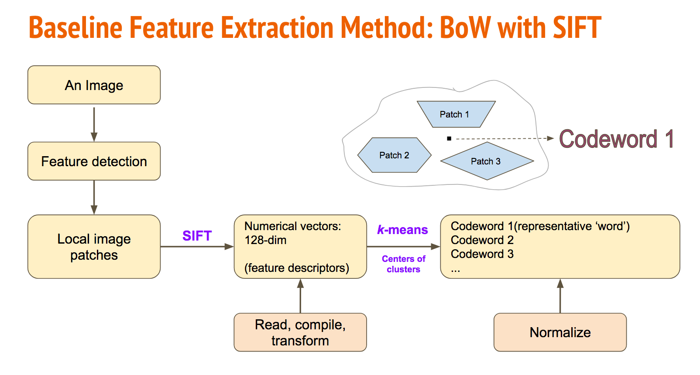

# Image Classification

+ Project summary: Extracted features of cats and dogs, explored and compared various classification models to detect whether an image shows a cat :cat2: or dog :dog2:.

 + Baseline model: GBM with SIFT + HoG features
   
 + Proposed model: 
 
### SIFT (Scale-Invariant Feature Transform) Process
 
 
 
 
 
 
